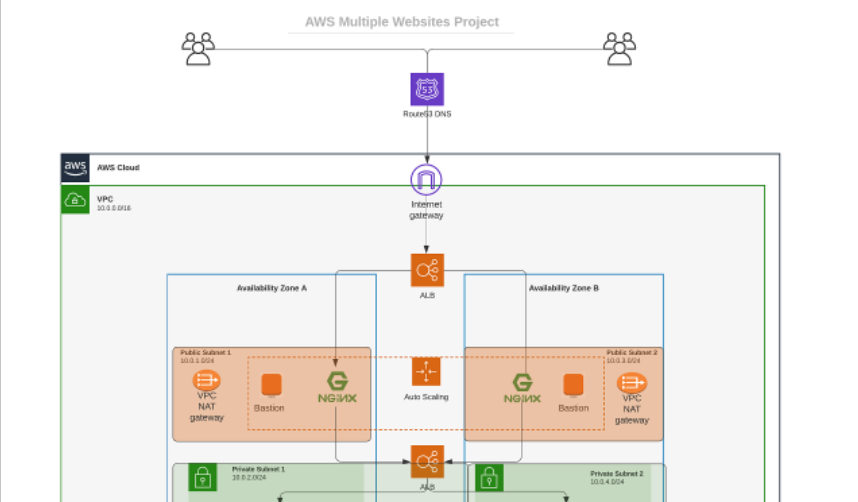
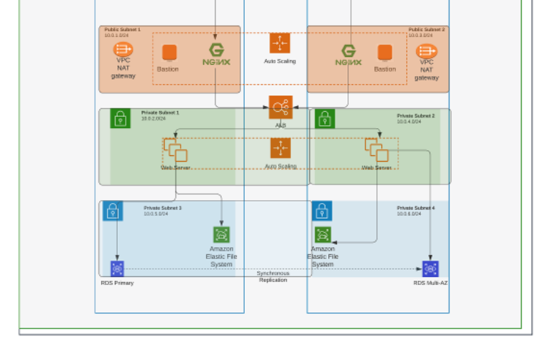

## PROJECT 15

You have been doing great work so far – implementing different Web Solutions and getting hands on experience with many great DevOps tools. In previous projects you used **basic Infrastructure as a Service (IaaS)** offerings from AWS such as EC2 (Elastic Compute Cloud) as rented Virtual Machines and EBS (Elastic Block Store), you have also learned how to configure Key pairs and basic Security Groups.

But the power of Clouds is not only in being able to rent Virtual Machines – it is much more than that. From now on, you will start gradually study different Cloud concepts and tools on example of AWS, but do not be worried, your knowledge will not be limited to only AWS specific concepts – overall principles are common across most of the major Cloud Providers (e.g., Microsoft Azure and Google Cloud Platform).

**NOTE**: The next few projects will be implemented manually. Before you begin to automate infrastructure in the cloud, it is very important that you can build the solution manually. Otherwise, programming your automation may become frustrating very quickly.

You will build a secure infrastructure inside AWS VPC (Virtual Private Cloud) network for a fictitious company (Choose an interesting name for it) that uses **WordPress CMS** for its main business website, and a **Tooling Website (https://github.com/<your-name>/tooling)** for their DevOps team. As part of the company’s desire for improved security and performance, a decision has been made to use a **reverse proxy technology from NGINX** to achieve this.

Cost, Security, and Scalability are the major requirements for this project. Hence, implementing the architecture designed below, ensure that infrastructure for both websites, WordPress and Tooling, is resilient to Web Server’s failures, can accomodate to increased traffic and, at the same time, has reasonable cost.

## Starting Off Your AWS Cloud Project

There are few requirements that must be met before you begin:

1. Properly configure your AWS account and Organization Unit **Watch How To Do This Here** https://youtu.be/9PQYCc_20-Q

- Create an AWS Master account. (Also known as Root Account)
- Within the Root account, create a sub-account and name it DevOps. (You will need another email address to complete this)
- Within the Root account, create an AWS Organization Unit (OU). Name it Dev. (We will launch Dev resources in there)
- Move the DevOps account into the Dev OU.
- Login to the newly created AWS account using the new email address.

2. Create a free domain name for your fictitious company at Freenom domain registrar here.

3. Create a hosted zone in AWS, and map it to your free domain from Freenom. **Watch how to do that here** https://youtu.be/IjcHp94Hq8A

**NOTE** : As you proceed with configuration, ensure that all resources are appropriately tagged, for example:

- Project: <Give your project a name>
- Environment: <dev>
- Automated: <No> (If you create a recource using an automation tool, it would be <Yes>)

## SET UP A VIRTUAL PRIVATE NETWORK (VPC)

Always make reference to the architectural diagram and ensure that your configuration is aligned with it.

1. Create a VPC (onyi-vpc with IPV4 CIDR of 10.0.0.0/16)
  - Enable DNS hostnames

2. Create an Internet Gateway (onyi-igw) and attach to our VPC

3. Create subnets as shown in the architecture
  - onyi-public-subnet-1 with IPV4 CIDR of 10.0.0.0/24 in us-east-2a
  - onyi-public-subnet-2 with IPV4 CIDR of 10.0.1.0/24 in us-east-2b
  - onyi-private-subnet-1 with IPV4 CIDR of 10.0.2.0/24 in us-east-2a
  - onyi-private-subnet-2 with IPV4 CIDR of 10.0.3.0/24 in us-east-2b
  - onyi-private-subnet-3 with IPV4 CIDR of 10.0.4.0/24 in us-east-2a
  - onyi-private-subnet-4 with IPV4 CIDR of 10.0.5.0/24 in us-east-2b

4. Create a route table and associate it with public subnets
  - Name: onyi-public-rtb

5. Create a route table and associate it with private subnets
  - Name: onyi-private-rtb 

6. Edit a route in public route table, and associate it with the Internet Gateway. (This is what allows a public subnet to be accesible from the Internet)

7. Create 3 Elastic IPs

8. Create a Nat Gateway and assign one of the Elastic IPs (*The other 2 will be used by Bastion hosts)
  - Go back to your private route table and edit it to point to the nat gateway created

9. Create a Security Group for: From our diagram

    - **External Application Load Balancer**: External ALB will be available from the Internet

    - **Nginx reverse proxy Servers**: Access to Nginx should only be allowed from a external Application Load balancer (ALB). So while editting the inbound rule for this security group , you should reference the security group for the external Application load balancer. Also since we may need to ssh from bastion into the nginx reverse proxy server , we also need to open ssh port in the inbound rule referencing the security group for the bastion.

    - **Bastion Servers**: Access to the Bastion servers should be allowed only from workstations that need to SSH into the bastion servers. Hence, you can use your workstation public IP address. To get this information, simply go to your terminal and type curl www.canhazip.com
    
    - **Internal Load balancer**: Internal Application load balancer will be available from the nginx reverse proxy servers. So edit the inbound rule to reference the security group for the nginx reverse proxy servers

    - **Webservers**: Access to Webservers should only be allowed from the Internal load balancer. So edit the inbound rule to reference the security group for the Internal Application load balancer. Also since we may need to ssh from bastion into the webservers , we also need to open ssh port in the inbound rule referencing the security group for the bastion.

    - **Data Layer**: Access to the Data layer, which is comprised of Amazon Relational Database Service (RDS) and Amazon Elastic File System (EFS) must be carefully desinged – webservers should be able to connect to RDS through mysql port and also have access to EFS Mountpoint through NFS port using the security group for the webservers .Also since we may need to go from bastion into the RDS using mysql-client , we also need to open mysql port in the inbound rule referencing the security group for the bastion.

## Proceed With Compute Resources

You will need to set up and configure compute resources inside your VPC. The recources related to compute are:

- TLS Certificates
- Elastic File System and the Access points for wordpress and tooling
- RDS- Subnet Group
- EC2 Instances
- AMI
- Launch Templates
- Target Groups
- Autoscaling Groups
- Application Load Balancers (ALB)

### TLS Certificates From Amazon Certificate Manager (ACM)
You will need TLS certificates to handle secured connectivity to your Application Load Balancers (ALB).

1. Navigate to AWS ACM
2. Request a public wildcard certificate for the domain name you registered in Freenom
3. Use DNS to validate the domain name
4. Tag the resource

## Setup EFS

Amazon Elastic File System (Amazon EFS) provides a simple, scalable, fully managed elastic Network File System (NFS) for use with AWS Cloud services and on-premises resources. In this project, we will utulize EFS service and mount filesystems on both Nginx and Webservers to store data.

1. Create an EFS filesystem
2. Create an EFS mount target per AZ in the VPC, specify the subnets for the webservers which is private-subnet 1 and 2, so that the resources in that subnet will be able to mount on the file system. Whenever you specify your mount subnet, the amazon elastic file system becomes available in that subnet.
3. Associate the Security groups created earlier for data layer.
4. Create an EFS access point. This is what we specify the webserver to mount with. So we need to create two access points,so that we dont have to mount the two websites on a single access point, one for wordpress website and the other for tooling website. If this is not created differently the file can override each other and it will not be good for our infrastruture.(Give it a name and leave all other settings as default)

## Setup RDS
**Pre-requisite**: Create a KMS key from Key Management Service (KMS) to be used to encrypt the database instance.

Amazon Relational Database Service (Amazon RDS) is a managed distributed relational database service by Amazon Web Services. This web service running in the cloud designed to simplify setup, operations, maintenans & scaling of relational databases. Without RDS, Database Administrators (DBA) have more work to do, due to RDS, some DBAs have become jobless

To ensure that yout databases are highly available and also have failover support in case one availability zone fails, we will configure a multi-AZ set up of RDS MySQL database instance. In our case, since we are only using 2 AZs, we can only failover to one, but the same concept applies to 3 Availability Zones. We will not consider possible failure of the whole Region, but for this AWS also has a solution – this is a more advanced concept that will be discussed in following projects.

To configure RDS, follow steps below:

1. Create a subnet group and add 2 private subnets (data Layer)(10.0.4.0/24 and 10.0.5.0/24)
2. Create an RDS Instance for mysql 8.*.*
3. To satisfy our architectural diagram, you will need to select either Dev/Test or Production Sample Template. But to minimize AWS cost, you can select the free tier. Do not create a standby instance option under Availability & durability sample template (The production template will enable Multi-AZ deployment)
4. Configure other settings accordingly (For test purposes, most of the default settings are good to go). In the real world, you will need to size the database appropriately. You will need to get some information about the usage. If it is a highly transactional database that grows at 10GB weekly, you must bear that in mind while configuring the initial storage allocation, storage autoscaling, and maximum storage threshold.
5. Configure VPC and security (ensure the database is not available from the Internet)
6. Configure backups and retention
7. Encrypt the database using the KMS key created earlier
8. Enable CloudWatch monitoring and export Error and Slow Query logs (for production, also include Audit)

**Note** This service is an expensinve one. Ensure to review the monthly cost before creating. (DO NOT LEAVE ANY SERVICE RUNNING FOR LONG)

## Set Up Compute Resources for Nginx

### Provision EC2 Instances for Nginx

1. Create an EC2 Instance based on Redhat Amazon Machine Image (AMI) in any 2 Availability Zones (AZ) in any AWS Region (it is recommended to use the Region that is closest to your customers). Use EC2 instance of T2 family (e.g. t2.micro or similar)

2. Ensure that it has the following software installed:

- python
- ntp
- net-tools
- vim
- wget
- telnet
- epel-release
- htop

3. Create an AMI out of the EC2 instance

Prepare Launch Template For Nginx (One Per Subnet)
1. Make use of the AMI to set up a launch template
2. Ensure the Instances are launched into a public subnet
3. Assign appropriate security group
4. Configure Userdata to update yum package repository and install nginx

Configure Target Groups
1. Select Instances as the target type
2. Ensure the protocol HTTPS on secure TLS port 443
3. Ensure that the health check path is /healthstatus
4. Register Nginx Instances as targets
5. Ensure that health check passes for the target group

Configure Autoscaling For Nginx
1. Select the right launch template
2. Select the VPC
3. Select both public subnets
4. Enable Application Load Balancer for the AutoScalingGroup (ASG)
5. Select the target group you created before
6. Ensure that you have health checks for both EC2 and ALB
7. The desired capacity is 1
8. Minimum capacity is 1
9. Maximum capacity is 1
10. Set scale out if CPU utilization reaches 90%
11. Ensure there is an SNS topic to send scaling notifications

### Set Up Compute Resources for Bastion

Provision the EC2 Instances for Bastion
1. Create an EC2 Instance based on Redhat Amazon Machine Image (AMI) per each Availability Zone in the same Region and same AZ where you created Nginx server
2. Ensure that it has the following software installed

  -  python
  -  ntp
  -  net-tools
  -  vim
  -  wget
  -  telnet
  -  epel-release
  -  htop

3. Associate an Elastic IP with each of the Bastion EC2 Instances
4. Create an AMI out of the EC2 instance

### Prepare Launch Template For Bastion (One per subnet)

1. Make use of the AMI to set up a launch template
2. Ensure the Instances are launched into a public subnet
3. Assign appropriate security group
4. Configure Userdata to update yum package repository and install Ansible and git

### Configure Target Groups
Since our bastion will not be placed under a load balancer, there wont be any need to configure a target group for it.

### Configure Autoscaling For Bastion
1. Select the right launch template
2. Select the VPC
3. Select both public subnets
4. The desired capacity is 1
5. Minimum capacity is 1
6. Maximum capacity is 1
7. Set scale out if CPU utilization reaches 90%
8. Ensure there is an SNS topic to send scaling notifications

### Set Up Compute Resources for Webservers
#### Provision the EC2 Instances for Webservers
Now, you will need to create 2 separate launch templates for both the WordPress and Tooling websites

1. Create an EC2 Instance Redhat Amazon Machine Image (AMI) each for WordPress and Tooling websites per Availability Zone (in the same Region).

2. Ensure that it has the following software installed

  -  python
  -  ntp
  -  net-tools
  -  vim
  -  wget
  -  telnet
  -  epel-release
  -  htop
  -  php

3. Create an AMI out of the EC2 instance

#### Prepare Launch Template For Webservers (One per subnet)
1. Make use of the AMI to set up a launch template
2. Ensure the Instances are launched into a public subnet
3. Assign appropriate security group
4. Configure Userdata to update yum package repository and install wordpress (Only required on the WordPress launch template)

## CONFIGURE APPLICATION LOAD BALANCER (ALB)

### Application Load Balancer To Route Traffic To NGINX

Nginx EC2 Instances will have configurations that accepts incoming traffic only from Load Balancers. No request should go directly to Nginx servers. With this kind of setup, we will benefit from intelligent routing of requests from the ALB to Nginx servers across the 2 Availability Zones. We will also be able to offload SSL/TLS certificates on the ALB instead of Nginx. Therefore, Nginx will be able to perform faster since it will not require extra compute resources to valifate certificates for every request.

1. Create an Internet facing ALB
2. Ensure that it listens on HTTPS protocol (TCP port 443)
3. Ensure the ALB is created within the appropriate VPC | AZ | Subnets
4. Choose the Certificate from ACM
5. Select Security Group
6. Select Nginx Instances as the target group

### Application Load Balancer To Route Traffic To Web Servers

Since the webservers are configured for auto-scaling, there is going to be a problem if servers get dynamically scalled out or in. Nginx will not know about the new IP addresses, or the ones that get removed. Hence, Nginx will not know where to direct the traffic.

To solve this problem, we must use a load balancer. But this time, it will be an internal load balancer. Not Internet facing since the webservers are within a private subnet, and we do not want direct access to them.

1. Create an Internal ALB
2. Ensure that it listens on HTTPS protocol (TCP port 443)
3. Ensure the ALB is created within the appropriate VPC | AZ | Subnets
4. Choose the Certificate from ACM
5. Select Security Group
6. Select webserver Instances as the target group
7. Ensure that health check passes for the target group

**NOTE**: This process must be repeated for both WordPress and Tooling websites.

## Configuring DNS with Route53

Earlier in this project you registered a free domain with Freenom and configured a hosted zone in Route53. But that is not all that needs to be done as far as DNS configuration is concerned.

You need to ensure that the main domain for the WordPress website can be reached, and the subdomain for Tooling website can also be reached using a browser.

Create other records such as CNAME, alias and A records.

**NOTE**: You can use either CNAME or alias records to achieve the same thing. But alias record has better functionality because it is a faster to resolve DNS record, and can coexist with other records on that name. Read here to get to know more about the differences.

- Create an alias record for the root domain and direct its traffic to the ALB DNS name.
- Create an alias record for tooling.<yourdomain>.com and direct its traffic to the ALB DNS name.

Congratulations!

# SUMMARY

1. Create a VPC
2. Create the subnets 
3. Create the Internet Gateway
4. Create route table for the public subnet to use  (Public Route Table)
5. Create a route in the public route table and point to the Internet gateway
6. Associate the public subnets to the created route table
7. Create a NAT Gateway so that servers in the private subnet can reach the internet to for example download stuff (Outbound)
8. Create route table for the private subnet to use (Private Route Table)
9. Create a route in the created route table and point to the NAT Gateway
10. Associate the private subnets (for compute only) to the private route table
11. Create security group for Bastion. Allow all DevOps engineers to connect over SSH to the Bastion server
12. Create security group and allow the entire world to talk to the ALB
13. Create security group and allow the ALB to talk to the Nginx proxy server.
14. Create an External facing Application Load Balancer (ALB)
15. Create a Listener (port 80) and target group
16. Create a Launch Template for nginx (Use a redhat based AMI)
17. Create ASG for nginx

18. Create a Launch Template for Bastion 
19. Create ASG for Bastion
20. Connect to Bastion server launched in the Public Subnet
21. Connect to the nginx server launched in the Private Subnet
22. create a userdata.sh script to bring up nginx 

sudo yum update -y
sudo yum install -y https://dl.fedoraproject.org/pub/epel/epel-release-latest-7.noarch.rpm
sudo yum install -y dnf-utils http://rpms.remirepo.net/enterprise/remi-release-7.rpm
sudo yum install -y nginx git
sudo systemctl restart nginx

20. Ensure that the nginx Target group is healthy
    1.  Check the security of the instance and ensure it allows port 80
21. Create Route53 entry. Point the DNS to the ALB

22. Create security group for internal ALB. (Alow traffic from Nginx proxy)
23. Create Security group for Wordpress site (Allow traffic from internal ALB)
24. Create Security group for Tooling site (Allow traffic from internal ALB)
25. Create target group for Wordpress site
26. Create target group for tooling site
27. Create internal ALB and configure listeners with Host header rules for both wordpress and tooling sites

28. Configure instance profile and give the tooling and wordpress instances relevant permissions to access AWS resources (for example, S3, EFS)
29. Create Launch Template for Tooling ASG (Ensure the IAM for instance profile is configured)
30. Create Launch Template for Wordpress ASG (Ensure the IAM for instance profile is configured)
31. Create ASG for Tooling instances
32. Create ASG for Wordpress instances
33. Configure nginx to upstream to internal ALB

server {
    listen 80;
    server_name www.tooling.svc.darey.io;
    location / {
        proxy_pass http://internal-masterclass-internal-alb-1479104505.eu-west-2.elb.amazonaws.com;
        proxy_set_header Host $host;
    }
}

33. Create Security Group for EFS - Allow access from Tooling and Wordpress on NFS port
34. Create IAM Instance Profile
35. Create EFS File system (SG)
36. Create EFS Access Point (Optional)
    
37. Create Security Group for RDS
38. Create the KMS key for RDS data encryption
39. Create DB subnet group
40. Create RDS/Aurora Database